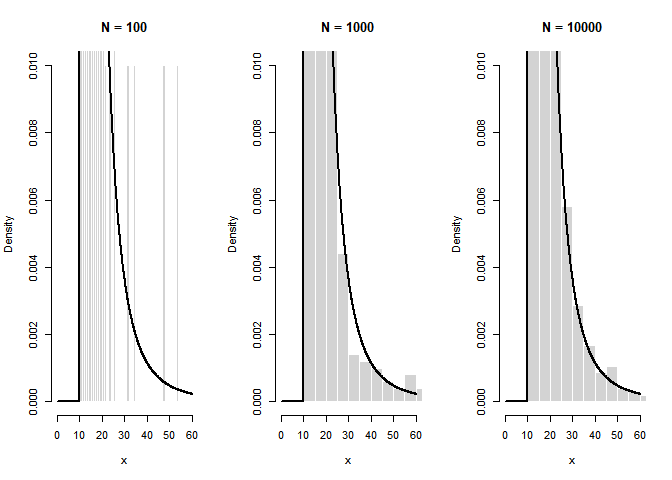

STAT 4100 Homework 2
================
Ryan Lynch
2026-01-29

Problem 1, part d

``` r
gamma = 4
x_0 = 10
Ns <- c(100,1000, 10000)
```

``` r
power_func <- function(n, gamma, x_0) {
  U <- runif(n)
  x_0 * (1-U)^(-1/(gamma-1))
}

theory_func <- function(x) {
  ifelse(x >= x_0, (gamma-1)*x_0^(gamma-1)*x^(-gamma), 0)
}
```

``` r
x_vals <- seq(0, 60, length.out = 1000)
par(mfrow = c(1,3))
for (N in Ns) {
  X <- power_func(N, gamma, x_0)
  
  hist(X, 
       breaks = 40,
       probability = TRUE, 
       xlim = c(0,60),
       ylim = c(0, 0.01),
       main = paste("N =", N),
       xlab = "x", 
       col = "lightgray",
       border = "white")
  
  lines(x_vals, theory_func(x_vals), lwd = 2)
}
```



Problem 2, part b

``` r
N <- 1e6
U <- runif(N)
g <- function(x, u) {
  1 - (x + 1)*exp(-x) - u
}
```

``` r
X <- numeric(N)
start_time <- Sys.time()

for (i in 1:N) {
  X[i] <- uniroot(g,
                  lower = 0, 
                  upper = 100,
                  u = U[i])$root
}

end_time <- Sys.time()
```

``` r
end_time - start_time
```

    ## Time difference of 24.82995 secs

Problem 2, part c

``` r
N <- 1e6
c <- 4/exp(1)
X <- numeric(N)
count <- 0
```

``` r
start_time <- Sys.time()
while (count < N) {
  Y <- rexp(1, rate = 1/2)
  U <- runif(1)
  
  if (U <- (2 * Y * exp(-Y / 2)) / c) {
    count <- count + 1
    X[count] <- Y
  }
}

end_time <- Sys.time()
```

``` r
end_time - start_time
```

    ## Time difference of 1.058776 secs

Problem 2, part d

``` r
N <- 1e6
start_time <- Sys.time()
X <- rexp(N, rate = 1) + rexp(N, rate = 1)
end_time <- Sys.time()
```

``` r
end_time - start_time
```

    ## Time difference of 0.05178404 secs

Problem 2, part e

``` r
N <- 1e6
X <- rexp(N, rate = 1) + rexp(N, rate = 1)
theory_func <- function(x){
  ifelse(x >= 0, x * exp(-x), 0)
}

hist(X,
     breaks = 100, 
     probability = TRUE,
     col = "lightgray",
     border = "white",
     xlim = c(0, 20),
     main = "Gamma(2,1) Samples vs Theoretical PDF",
     xlab = "x",
     ylab = "Density")

x_vals <- seq(0, 20, length.out = 1000)
lines(x_vals, theory_func(x_vals), col = "red", lwd = 3)
```


