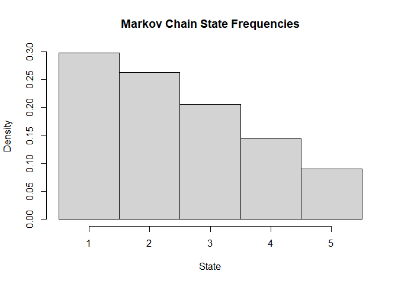
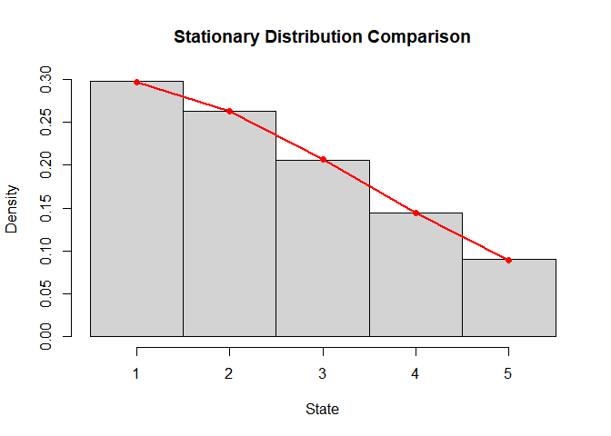
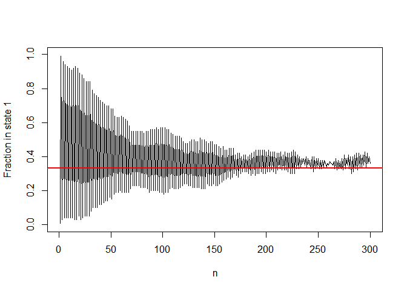
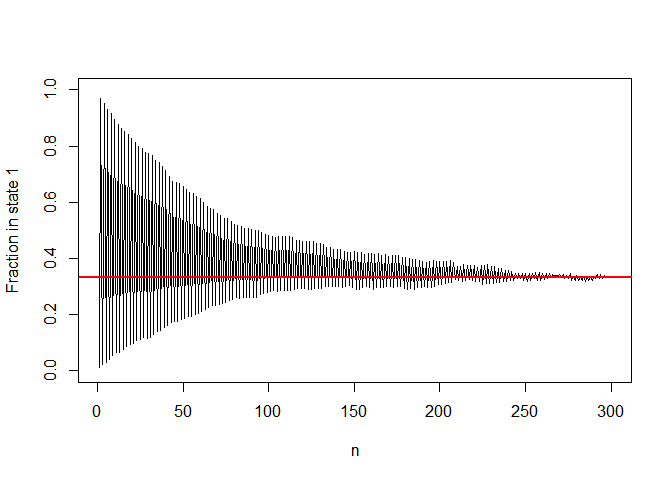
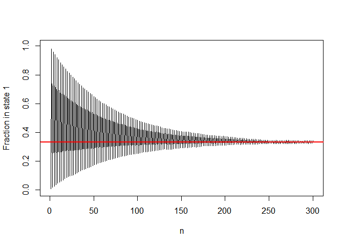

STAT 4100 Homework 5
================
Ryan Lynch
2026-03-05

Problem 2, part b

``` r
a <- 0.04
b <- 0.16
K <- 0.1

p <- K*exp(a*(1:4))
q <- K*exp(b*(1:4))

P <- matrix(0,5,5)

for(n in 1:5){
  
  if(n<=4){
    P[n,n+1] <- K*exp(a*n)
  }
  
  if(n>=2){
    P[n,n-1] <- K*exp(b*(n-1))
  }
  
}

for(n in 1:5){
  P[n,n] <- 1 - sum(P[n,])
}

eig <- eigen(t(P))
vec <- Re(eig$vectors[,1])
pi <- vec/sum(vec)

pi
```

    ## [1] 0.29651214 0.26298267 0.20686950 0.14432795 0.08930774

Problem 2, part c

``` r
set.seed(1)

steps <- 1e6
state <- 3
states <- numeric(steps)

for(i in 1:steps){
  
  probs <- P[state,]
  state <- sample(1:5,1,prob=probs)
  states[i] <- state
  
}

hist(states, breaks=seq(0.5,5.5,1),
     probability=TRUE,
     main="Markov Chain State Frequencies",
     xlab="State")
```


Problem 2, part d

``` r
hist(states,
     breaks=seq(0.5,5.5,1),
     probability=TRUE,
     col="lightgray",
     main="Stationary Distribution Comparison",
     xlab="State")

points(1:5, pi, col="red", pch=19)
lines(1:5, pi, col="red", lwd=2)
```


Problem 3, part e

``` r
a <- 0.99
P <- matrix(c(
  1-a, a, 0,
  a, 0, 1-a,
  0, 1-a, a
),3,3,byrow=TRUE)

simulate_chain <- function(n){
  state <- 1
  states <- numeric(n)
  
  for(i in 1:n){
    state <- sample(1:3,1,prob=P[state,])
    states[i] <- state
  }
  
  states
}

N <- 100
steps <- 300
chains <- replicate(N, simulate_chain(steps))

f <- sapply(1:steps, function(i){
  mean(chains[i,]==1)
})

plot(f, type="l", ylim = c(0,1),
     ylab = "Fraction in state 1",
     xlab = "n")
abline(h=1/3, col="red", lwd=2)
```



``` r
a <- 0.99
P <- matrix(c(
  1-a, a, 0,
  a, 0, 1-a,
  0, 1-a, a
),3,3,byrow=TRUE)

simulate_chain <- function(n){
  state <- 1
  states <- numeric(n)
  
  for(i in 1:n){
    state <- sample(1:3,1,prob=P[state,])
    states[i] <- state
  }
  
  states
}

N <- 1000
steps <- 300
chains <- replicate(N, simulate_chain(steps))

f <- sapply(1:steps, function(i){
  mean(chains[i,]==1)
})

plot(f, type="l", ylim = c(0,1),
     ylab = "Fraction in state 1",
     xlab = "n")
abline(h=1/3, col="red", lwd=2)
```



``` r
a <- 0.99
P <- matrix(c(
  1-a, a, 0,
  a, 0, 1-a,
  0, 1-a, a
),3,3,byrow=TRUE)

simulate_chain <- function(n){
  state <- 1
  states <- numeric(n)
  
  for(i in 1:n){
    state <- sample(1:3,1,prob=P[state,])
    states[i] <- state
  }
  
  states
}

N <- 10000
steps <- 300
chains <- replicate(N, simulate_chain(steps))

f <- sapply(1:steps, function(i){
  mean(chains[i,]==1)
})

plot(f, type="l", ylim = c(0,1),
     ylab = "Fraction in state 1",
     xlab = "n")
abline(h=1/3, col="red", lwd=2)
```


