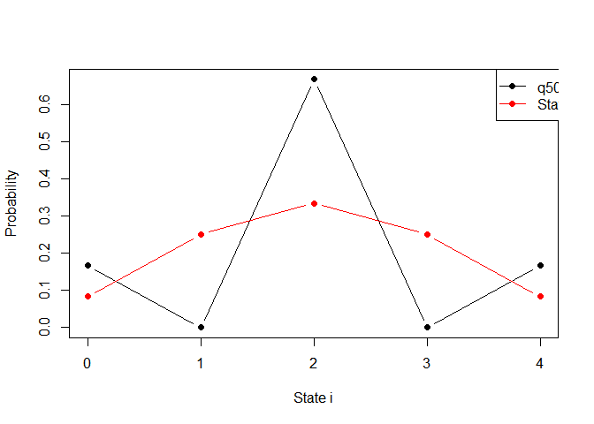
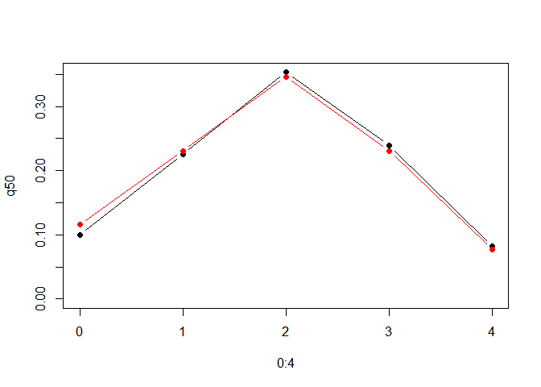

STAT 4100 Homework 6
================
Ryan Lynch
2026-03-16

Problem 1, part d

``` r
P <- matrix(c(
0,1,0,0,0,
1/3,0,2/3,0,0,
0,1/2,0,1/2,0,
0,0,2/3,0,1/3,
0,0,0,1,0
), nrow=5, byrow=TRUE)

q0 <- c(0,0,1,0,0)

# matrix power
library(expm)

q50 <- q0 %*% (P %^% 50)

pi <- c(1,3,4,3,1)/12

plot(0:4, q50, type="b", pch=19, ylim=c(0,max(pi,q50)),
     xlab="State i", ylab="Probability")
lines(0:4, pi, type="b", col="red", pch=19)

legend("topright",inset=c(-0.125,0),
       legend=c("q50","Stationary π"),
       col=c("black","red"),
       lty=1, pch=19)
```



Problem 2, part d

``` r
P <- matrix(c(
0,2/3,1/3,0,0,
1/3,0,2/3,0,0,
1/15,7/15,0,7/15,0,
0,0,2/3,0,1/3,
0,0,0,1,0
), nrow=5, byrow=TRUE)

q0 <- c(0,0,1,0,0)

q50 <- q0 %*% (P %^% 50)

pi <- c(3,6,9,6,2)/26

plot(0:4,q50,type="b",pch=19,ylim=c(0,max(pi,q50)))
lines(0:4,pi,type="b",col="red",pch=19)

legend("topright", inset=c(-0.22,-0.2),
       legend=c("q50","Stationary π"),
       col=c("black","red"),
       lty=1,pch=19)
```



Problem 4, part b

``` r
set.seed(1)

a <- 0.49
runs <- 1000
max_gen <- 200

extinct <- 0

for (i in 1:runs) {
  
  X <- 1
  
  for (g in 1:max_gen) {
    
    Z <- rbinom(1, X, 1-a)
    X <- 2*Z
    
    if (X == 0) {
      extinct <- extinct + 1
      break
    }
  }
}

ext_prob <- extinct/runs
ext_prob
```

    ## [1] 0.951
