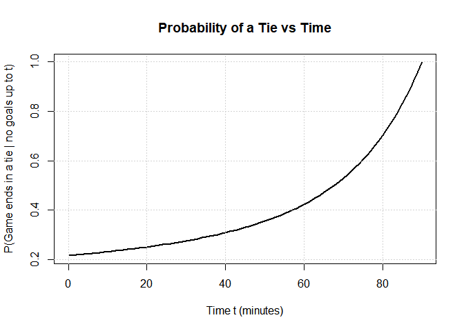
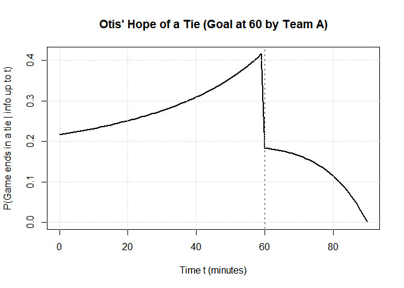
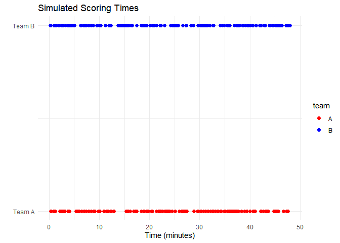
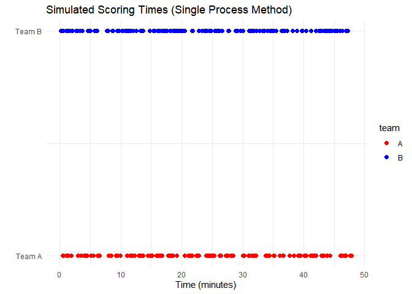
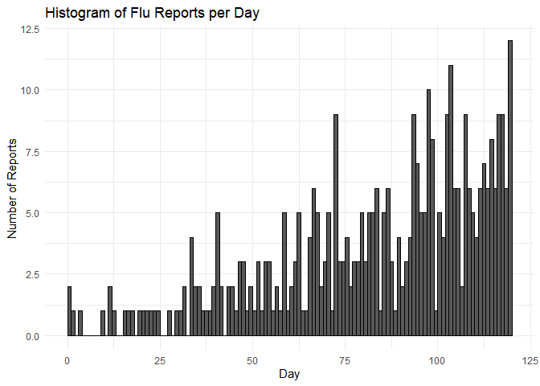

STAT 4100 Homework 7
================
Ryan Lynch
2026-04-06

\#Problem 1, part b

``` r
# Time grid (0 to 90 minutes)
t_vals <- seq(0, 90, by = 1)

# Function to compute probability of tie
prob_tie <- function(t, max_k = 15) {
  
  # Adjusted Poisson means for remaining time
  lambda_A <- 2 * (90 - t) / 90
  lambda_B <- 1.5 * (90 - t) / 90
  
  # Compute sum P(X=k)P(Y=k)
  k_vals <- 0:max_k
  probs <- dpois(k_vals, lambda_A) * dpois(k_vals, lambda_B)
  
  sum(probs)
}

# Compute probabilities over time
p_vals <- sapply(t_vals, prob_tie)

# Plot
plot(t_vals, p_vals, type = "l",
     xlab = "Time t (minutes)",
     ylab = "P(Game ends in a tie | no goals up to t)",
     main = "Probability of a Tie vs Time",
     lwd = 2)

# Optional: add grid
grid()
```



\#Problem 1, part c

``` r
t_vals <- seq(0, 90, by = 1)

# Function for probability of tie
prob_tie_updated <- function(t, max_k = 20) {
  
  # Remaining time scaling
  lambda_A <- 2 * (90 - t) / 90
  lambda_B <- 1.5 * (90 - t) / 90
  
  k_vals <- 0:max_k
  
  if (t < 60) {
    # Before goal: need equal goals
    probs <- dpois(k_vals, lambda_A) * dpois(k_vals, lambda_B)
  } else {
    # After goal: need B to score one more than A
    probs <- dpois(k_vals, lambda_A) * dpois(k_vals + 1, lambda_B)
  }
  
  sum(probs)
}

# Compute values
p_vals <- sapply(t_vals, prob_tie_updated)

# Plot
plot(t_vals, p_vals, type = "l",
     xlab = "Time t (minutes)",
     ylab = "P(Game ends in a tie | info up to t)",
     main = "Otis' Hope of a Tie (Goal at 60 by Team A)",
     lwd = 2)

# Add vertical line at goal time
abline(v = 60, lty = 2)

grid()
```



\#Problem 2, part c

``` r
set.seed(123)

lambda <- 3
T <- 48

simulate_times <- function(lambda, T) {
  times <- c()
  current_time <- 0
  
  while (TRUE) {
    interarrival <- rexp(1, rate = lambda)
    current_time <- current_time + interarrival
    
    if (current_time > T) break
    times <- c(times, current_time)
  }
  
  return(times)
}

# Simulate scoring times
times_A <- simulate_times(lambda, T)
times_B <- simulate_times(lambda, T)

# Create dataframe
library(ggplot2)

df_A <- data.frame(time = times_A, team = "A", y = 1)
df_B <- data.frame(time = times_B, team = "B", y = 2)
df <- rbind(df_A, df_B)

# Plot points
ggplot(df, aes(x = time, y = y, color = team)) +
  geom_point(size = 2) +
  scale_color_manual(values = c("A" = "red", "B" = "blue")) +
  scale_y_continuous(
    breaks = c(1, 2),
    labels = c("Team A", "Team B")
  ) +
  labs(
    title = "Simulated Scoring Times",
    x = "Time (minutes)",
    y = ""
  ) +
  theme_minimal()
```


\# Problem 2, part d

``` r
set.seed(123)

lambda <- 3
T <- 48

# Step 1: simulate ONE Poisson process with rate 2λ
simulate_times <- function(rate, T) {
  times <- c()
  current_time <- 0
  
  while (TRUE) {
    interarrival <- rexp(1, rate = rate)
    current_time <- current_time + interarrival
    
    if (current_time > T) break
    times <- c(times, current_time)
  }
  
  return(times)
}

all_times <- simulate_times(2 * lambda, T)

# Step 2: randomly assign each basket to A or B
teams <- sample(c("A", "B"), size = length(all_times), replace = TRUE)

# Step 3: create dataframe for plotting
library(ggplot2)

df <- data.frame(
  time = all_times,
  team = teams,
  y = ifelse(teams == "A", 1, 2)
)

# Step 4: plot points
ggplot(df, aes(x = time, y = y, color = team)) +
  geom_point(size = 2) +
  scale_color_manual(values = c("A" = "red", "B" = "blue")) +
  scale_y_continuous(
    breaks = c(1, 2),
    labels = c("Team A", "Team B")
  ) +
  labs(
    title = "Simulated Scoring Times (Single Process Method)",
    x = "Time (minutes)",
    y = ""
  ) +
  theme_minimal()
```


\# Problem 2, part e

``` r
set.seed(123)

lambda <- 3
t <- 48
n_sims <- 1e5

# Step 1: simulate total baskets
N <- rpois(n_sims, lambda = 2 * lambda * t)

# Step 2: simulate baskets for Team A given N
N_A <- rbinom(n_sims, size = N, prob = 0.5)

# Step 3: Team B
N_B <- N - N_A

# Step 4: score difference
D <- 2 * (N_A - N_B)

# ---- Estimates ----
E_est <- mean(D)
Var_est <- var(D)
P_tie_est <- mean(D == 0)

# ---- Theoretical values ----
E_theory <- 0
Var_theory <- 8 * lambda * t
P_tie_theory <- exp(-2 * lambda * t) * besselI(2 * lambda * t, nu = 0)

# ---- Print results ----
cat("Estimated E[D(t)]:", E_est, "\n")
```

    ## Estimated E[D(t)]: 0.05292

``` r
cat("Theoretical E[D(t)]:", E_theory, "\n\n")
```

    ## Theoretical E[D(t)]: 0

``` r
cat("Estimated Var[D(t)]:", Var_est, "\n")
```

    ## Estimated Var[D(t)]: 1160.345

``` r
cat("Theoretical Var[D(t)]:", Var_theory, "\n\n")
```

    ## Theoretical Var[D(t)]: 1152

``` r
cat("Estimated P(D(t)=0):", P_tie_est, "\n")
```

    ## Estimated P(D(t)=0): 0.02354

``` r
cat("Theoretical P(D(t)=0):", P_tie_theory, "\n")
```

    ## Theoretical P(D(t)=0): 0.02351812

# Problem 3, part c

``` r
set.seed(123)

T <- 120

# Rate function
lambda <- function(t) {
  0.5 * (1 + (t/30)^2)
}

lambda_max <- 8.5

# Step 1: simulate candidate arrivals from HPPP(lambda_max)
times <- c()
current_time <- 0

while (TRUE) {
  interarrival <- rexp(1, rate = lambda_max)
  current_time <- current_time + interarrival
  
  if (current_time > T) break
  times <- c(times, current_time)
}

# Step 2: thinning (accept/reject)
accepted_times <- c()

for (t in times) {
  if (runif(1) < lambda(t) / lambda_max) {
    accepted_times <- c(accepted_times, t)
  }
}

# Total number of reports
total_reports <- length(accepted_times)

# ---- Histogram per day ----
library(ggplot2)

ggplot(data.frame(time = accepted_times), aes(x = time)) +
  geom_histogram(binwidth = 1, boundary = 0, color = "black") +
  labs(
    title = "Histogram of Flu Reports per Day",
    x = "Day",
    y = "Number of Reports"
  ) +
  theme_minimal()
```



``` r
# ---- Compare with theoretical ----
cat("Simulated total reports:", total_reports, "\n")
```

    ## Simulated total reports: 376

``` r
cat("Expected total reports:", 380, "\n")
```

    ## Expected total reports: 380
