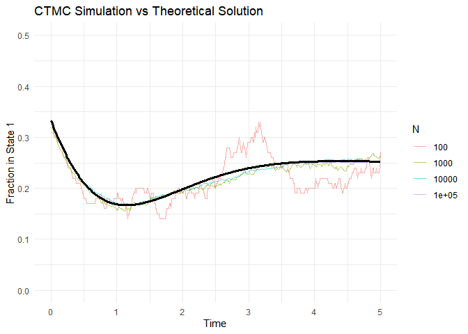

STAT 4100 Homework 8
================
Ryan Lynch
2026-04-14

# Problem 1, part e

``` r
library(tidyverse)

set.seed(123)

# ---- Theoretical function from part (d) ----
y1_theoretical <- function(t) {
  1/4 - (1/12)*exp(-2*t) + (1/6)*exp(-t)*cos(t) - (1/3)*exp(-t)*sin(t)
}

# ---- Function to simulate ONE chain ----
simulate_chain <- function(t_grid) {
  
  # Initial state
  state <- sample(c(1,2), size = 1, prob = c(1/3, 2/3))
  t <- 0
  
  states_over_time <- numeric(length(t_grid))
  idx <- 1
  
  while (idx <= length(t_grid)) {
    
    # Time until next jump
    wait <- rexp(1, rate = 1)
    next_t <- t + wait
    
    # Fill in states until next jump
    while (idx <= length(t_grid) && t_grid[idx] < next_t) {
      states_over_time[idx] <- state
      idx <- idx + 1
    }
    
    # Jump to next state in cycle
    state <- ifelse(state == 4, 1, state + 1)
    t <- next_t
  }
  
  return(states_over_time)
}

# ---- Function to simulate N chains ----
simulate_N <- function(N, t_grid) {
  sims <- replicate(N, simulate_chain(t_grid))
  
  # fraction in state 1 at each time
  f_t <- rowMeans(sims == 1)
  
  tibble(t = t_grid, f = f_t, N = as.factor(N))
}

# ---- Time grid ----
t_grid <- seq(0, 5, length.out = 500)

# ---- Run simulations ----
Ns <- c(100, 1000, 10000, 100000)

results <- map_dfr(Ns, ~simulate_N(.x, t_grid))

# ---- Theoretical curve ----
theory_df <- tibble(
  t = t_grid,
  y = y1_theoretical(t_grid)
)

# ---- Plot ----
ggplot() +
  geom_line(data = results, aes(x = t, y = f, color = N), alpha = 0.6) +
  geom_line(data = theory_df, aes(x = t, y = y), size = 1.2, color = "black") +
  
  coord_cartesian(xlim = c(0,5), ylim = c(0, 0.5)) +
  
  labs(
    title = "CTMC Simulation vs Theoretical Solution",
    x = "Time",
    y = "Fraction in State 1",
    color = "N"
  ) +
  
  theme_minimal()
```


