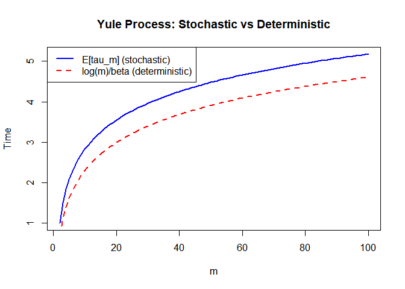

STAT 4100 Homework 9
================
Ryan Lynch
2026-04-22

\#Problem 1, part d

``` r
set.seed(1)

simulate_one <- function(L, alpha = 1, beta = 1) {
  i <- 0
  t <- 0
  
  while (i < L) {
    if (i == 0) {
      # only forward move
      rate <- alpha
      t <- t + rexp(1, rate)
      i <- 1
    } else {
      rate <- alpha + beta
      t <- t + rexp(1, rate)
      
      # choose direction
      if (runif(1) < alpha / (alpha + beta)) {
        i <- i + 1
      } else {
        i <- i - 1
      }
    }
  }
  
  return(t)
}

# Parameters
L <- 20
N <- 1000

# Run simulations
times <- replicate(N, simulate_one(L))

# Results
mean_time <- mean(times)
var_time <- var(times)

mean_time
```

    ## [1] 207.8697

``` r
var_time
```

    ## [1] 31189.52

``` r
set.seed(1)

simulate_one <- function(L, alpha = 1, beta = 1) {
  i <- 0
  t <- 0
  
  while (i < L) {
    if (i == 0) {
      # only forward move
      rate <- alpha
      t <- t + rexp(1, rate)
      i <- 1
    } else {
      rate <- alpha + beta
      t <- t + rexp(1, rate)
      
      # choose direction
      if (runif(1) < alpha / (alpha + beta)) {
        i <- i + 1
      } else {
        i <- i - 1
      }
    }
  }
  
  return(t)
}

# Parameters
L <- 20
N <- 10000

# Run simulations
times <- replicate(N, simulate_one(L))

# Results
mean_time <- mean(times)
var_time <- var(times)

mean_time
```

    ## [1] 207.1797

``` r
var_time
```

    ## [1] 29150.46

# Problem 4

``` r
beta <- 1
m_vals <- 2:100

# stochastic expectation
harmonic <- function(n) sum(1/(1:n))
E_tau <- sapply(m_vals, function(m) harmonic(m-1) / beta)

# deterministic
tau_det <- log(m_vals) / beta

plot(m_vals, E_tau, type="l", lwd=2,
     col="blue", xlab="m", ylab="Time",
     main="Yule Process: Stochastic vs Deterministic")

lines(m_vals, tau_det, col="red", lwd=2, lty=2)

legend("topleft",
       legend=c("E[tau_m] (stochastic)", "log(m)/beta (deterministic)"),
       col=c("blue","red"), lty=c(1,2), lwd=2)
```


